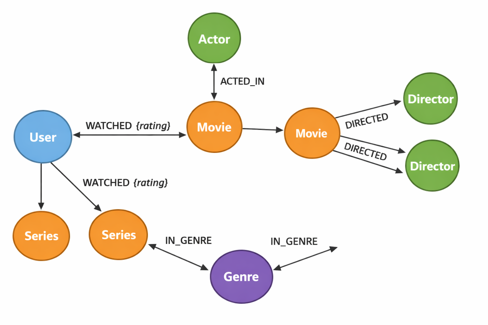

# Streaming Graph Database — Neo4j

> Bootcamp project focused on graph database modeling and Cypher queries.

## About the Project

This project presents the modeling of a **graph database for a movie and TV series streaming service using Neo4j**.

The goal is to represent relationships between users, movies, series, actors, directors, and genres, creating a data structure that can support relationship analysis and recommendation use cases.

This project was developed as a practical learning activity during a **DIO bootcamp**, with a focus on graph data modeling and Cypher queries.

## Technologies

* Neo4j
* Cypher
* Graph Data Modeling

## Graph Model

The database contains the following node types:

* `User`
* `Movie`
* `Series`
* `Genre`
* `Actor`
* `Director`

### Relationships

The main relationships in the graph include:

* `WATCHED` — connects users to movies or series and includes a `rating` property.
* `ACTED_IN` — connects actors to movies or series.
* `DIRECTED` — connects directors to movies or series.
* `IN_GENRE` — connects movies or series to their respective genres.

## Repository Structure

```text
data/
└── Dataset used in the project

scripts/
└── setup_database.cypher
    Script used to create nodes, relationships, and constraints

queries/
└── queries_examples.cypher
    Examples of Cypher queries used to explore the graph

images/
└── graph_model.png
    Graph data model diagram
```

## Example Query

The following Cypher query finds other movies that share the same genre as a selected movie:

```cypher
MATCH (m:Movie)-[:IN_GENRE]->(g)<-[:IN_GENRE]-(rec:Movie)
WHERE m.title = "Galaxy War"
  AND m <> rec
RETURN rec.title
```

## Business Queries

The graph was tested with queries representing common use cases for a streaming platform.

### 1. Highest-Rated Movies

Returns movies with the highest average user ratings.

### 2. History-Based Recommendations

Finds movies watched by users who also watched a selected title.

### 3. Movies by Genre

Lists movies belonging to a specific genre.

### 4. Movies by Actor

Returns movies associated with a selected actor.

### 5. Movies by Director

Lists movies associated with a selected director.

## Learning Outcomes

Through this project, I practiced:

* Graph database modeling
* Nodes and relationships
* Cypher query syntax
* Constraints
* Data relationships and traversal
* Basic recommendation use cases
* Structuring a graph database project

## Graph Model

The following diagram represents the data model used in the project.



## Project Context

This repository was developed as part of a **DIO bootcamp learning activity**.

It represents practical experience with Neo4j and graph data modeling. While Neo4j is not my current primary area of specialization, the project contributed to my understanding of databases, data relationships, and analytical thinking.

## Author

**Ishad Lima**

Aspiring Data Analyst focused on **Business Intelligence, Data Analytics, Excel, Power BI, SQL, and Python**.
